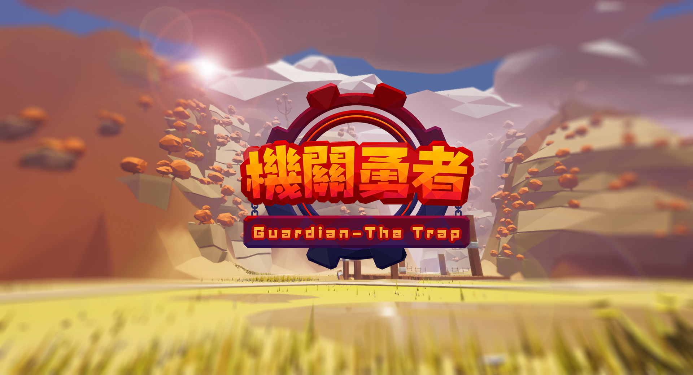
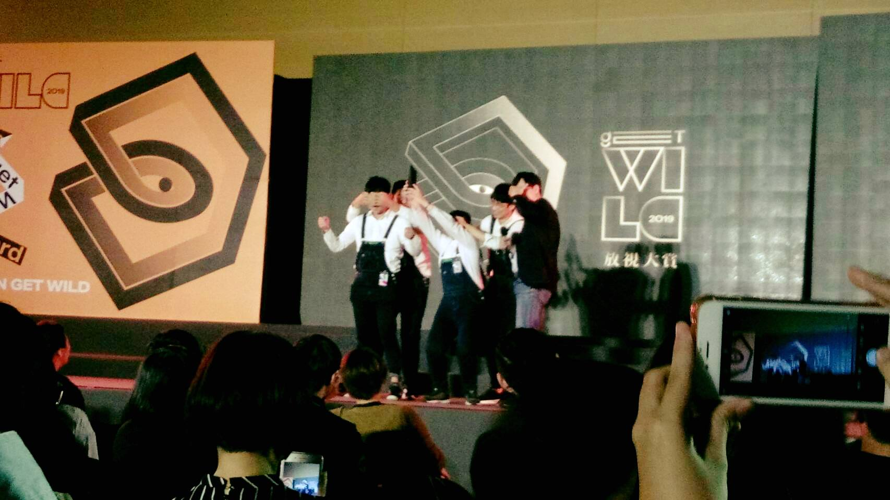

# 機關勇者 Guardian: The Trap

機關勇者是一款雙人同樂的VR塔防遊戲，可以單獨挑戰也可以與朋友一同遊玩。玩家將扮演奇幻世界裡的勇者，在魔物前來進攻的路上自由佈置陷阱及障礙物，以此將魔物消滅、守衛家園！機關勇者使用UE4遊戲引擎進行開發，並接入SteamVR SDK和Unreal RPC實現VR和連線功能，可以在HTC Vive上遊玩。此遊戲是與雲林科技大學數位媒體設計系的同學合作，遊戲內的美術、模型、動畫、音效和特效等也均為團隊自行製作。

## 實機影片

[流暢視頻](https://www.youtube.com/watch?v=sZQgl2KLmo0)

## 獲獎
2019 - 台灣放視大賞VR遊戲創作組 金獎

2019 - CGW VR Battle 數位內容多媒體組 第一名

2019 - 台灣原創遊戲大賞校園組 決賽入圍獎

## 備註
此倉庫只包含了藍圖代碼，把C++文件、美術和音效等部分排除了，項目無法編譯是正常的。

